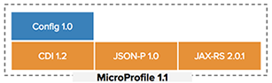
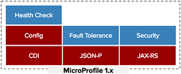

= Eclipse MicroProfile 1.1 is Now Available

Eclipse MicroProfile, an open forum to optimize Enterprise Java for a microservices architecture by innovating across multiple implementations and collaborating on common areas of interest with a goal of standardization, would like to announce the release of Eclipse MicroProfile 1.1.

Eclipse MicroProfile 1.1, which builds on the 1.0 version, adds a brand new Config API.

Environment configuration management has always been a challenge in Software Development Lifecycle (SDLC) and is usually addressed in an ad-hoc manner by IT organizations. Moving an application from the developer’s environment all the way to production in a consistent, repeatable and error-free manner has never been an easy task. Eclipse MicroProfile Config addresses this challenge by defining the framework and APIs to easily set and manage environment configurations for Enterprise Java microservices. Config externalizes the specific environment/stage configuration differences away from the application so that there’s no need to re-package/re-build the application when moving through the stages of SDLC.

Benefits of MicroProfile 1.1 are:  

* The incremental maturity of the specification offers users more functionality for implementing Enterprise Java microservices
* Config 1.0 gives users the ability to configure the application for different stages/environments throughout SDLC without having to re-package/re-build the application
* Interoperability across different implementations of MicroProfile 1.1 provides users the freedom to select one or combine many MicroProfile implementations in an application
* A thorough set of artifacts for Config 1.0, including a Test Compatibility Kit (TCK), Javadoc, PDF document for download, API Maven artifact coordinates, Git tag, and downloads (spec and source code)

Eclipse MicroProfile continues to deliver incremental value with each releases and to successfully evolve with the dynamic help of all its community members. Future release will update existing APIs and add new ones:

For more information on MicroProfile 1.1, please refer to:

* https://github.com/eclipse/microprofile-bom[MicroProfile BOM]
* http://microprofile.io[MicroProfile 1.1 Spec (PDF)]

For more information on Config 1.0, please check:

* http://microprofile.io/project/eclipse/microprofile-config[Configuration for MicroProfile]
* https://github.com/eclipse/microprofile-config/releases/tag/1.0[Download MicroProfile Config]

For more information on MicroProfile, please visit:

* http://microprofile.io[MicroProfile Website]

For MicroProfile roadmap and upcoming release trains, please go to:

* https://projects.eclipse.org/projects/technology.microprofile[MicroProfile Roadmap]
