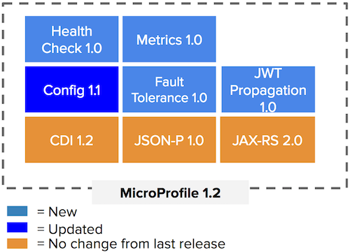
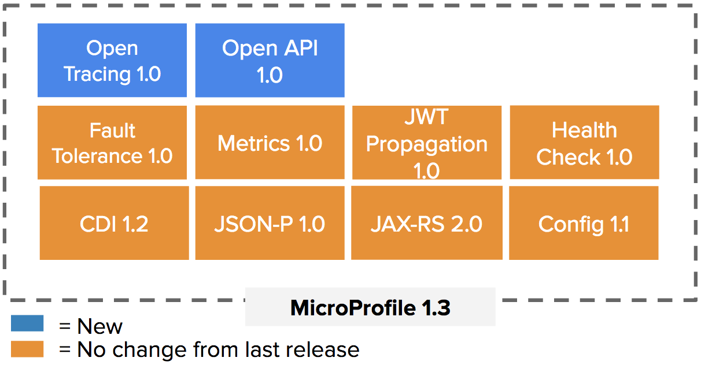
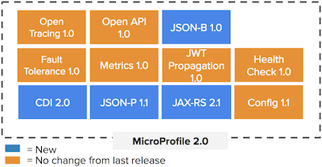

= Eclipse MicroProfile 1.2 is Now Available

Eclipse MicroProfile, an open forum to collaborate on Enterprise Java Microservices, would like to announce the release of Eclipse MicroProfile 1.2.

Eclipse MicroProfile 1.2, which builds on the 1.1 version, updates the Config API and adds the Health Check, Fault Tolerance, Metrics, and JWT Propagation APIs.

In a cloud infrastructure environment, where a running application in a microservice architecture may be composed of multiple running nodes, it is important for the underlying infrastructure processes to query and know the health of a node in order to take an appropriate action, e.g. passivate, terminate, replace the microservice. Likewise, microservices need to respond adequately in case of execution faults so that these faults do not bring down the service. Eclipse MicroProfile Health Check and Fault Tolerance address these two concerns.  In contrast to health checks, which are primarily targeted at a quick yes/no response to the question "Is my application still running ok?", metrics gathers essential system parameters, which can be monitored to ensure the reliable operation of microservices. In addition, authentication and authorization are concerns necessary for the secured execution of microservices. Eclipse MicroProfile Metrics and JWT Propagation respectively address these last two.

Benefits of MicroProfile 1.2 are:

* Additional features offering more functionality for implementing Enterprise Java microservices
* MicroProfile Health Check provides the ability for infrastructure systems to monitor the health and act upon it resulting in a more robust and available application
* MicroProfile Fault Tolerance adds constructs such as bulkhead, circuit breaker, fallback, retry policy and timeout to microservices resulting in a more available and resilient application
* MicroProfile Metrics help to determine the health of an application, serve to pinpoint issues, provide long term trend data for capacity planning and pro-active discovery of issues (e.g. disk usage growing without bounds). Metrics can also help scheduling systems decide when to scale the application to run on more or fewer instances
* MicroProfile JWT Propagation specifies MicroProfile-JWT tokens and how to map them to Java EE and non-Java EE containers resulting in more secure microservices using existing infrastructure environments
* Interoperability across different MicroProfile implementations provides users the freedom to select one or combine many MicroProfile implementations in an application
* A thorough set of artifacts for each API, including a Test Compatibility Kit (TCK), Javadoc, PDF document for download, API Maven artifact coordinates, Git tag, and downloads (spec and source code)

Eclipse MicroProfile continues to deliver additional value with each release and to successfully evolve with the dynamic help of all its community members. Future releases will update existing APIs and add new ones. MicroProfile 1.3 is scheduled to deliver:

And, MicroProfile 2.0 is scheduled to deliver:

For more information on MicroProfile 1.2, please refer to:

* https://github.com/eclipse/microprofile-bom/releases/tag/1.2[Eclipse MicroProfile 1.2]

For more information on Config 1.1, please check:

* https://github.com/eclipse/microprofile-config/releases/tag/1.1[Config 1.1]

For more information on Health Check 1.0, please check:

* https://github.com/eclipse/microprofile-health/releases/tag/1.0[Health Check 1.0]

For more information on Metrics 1.0, please check:

* https://github.com/eclipse/microprofile-metrics/releases/tag/1.0[Metrics 1.0]

For more information on Fault Tolerance 1.0, please check:

* https://github.com/eclipse/microprofile-fault-tolerance/releases/tag/1.0[Fault Tolerance 1.0]

For more information on JWT Propagation 1.0, please check:

* https://github.com/eclipse/microprofile-jwt-auth/releases/tag/1.0[JWT Propagation 1.0]

For more information on MicroProfile, please visit:

* http://microprofile.io[MicroProfile Website]

For MicroProfile roadmap and upcoming release trains, please go to:

* https://projects.eclipse.org/projects/technology.microprofile[MicroProfile Roadmap]
