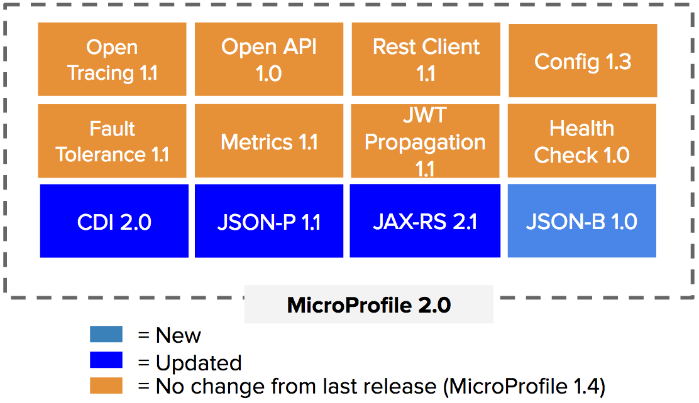

= Eclipse MicroProfile 1.4 and 2.0 are Now Available

Eclipse MicroProfile, an open forum to collaborate on Enterprise Java microservices, would like to announce the releases of Eclipse MicroProfile 1.4 and 2.0. With these releases, Eclipse MicroProfile offers the same level of functionality to be usable with either Java EE 7 or Java EE 8.

Eclipse MicroProfile 1.4, which builds on the 1.3 version, updates the Config, JWT Propagation, Fault Tolerance, Open Tracing, and Rest Client APIs.

image::MP1.4-diagram.png[1_4]

The Config API introduces improvements to implicit converters and Java 2 security updates, JWT Propagation adds support for configuring the public key and issuer needed for verification, Fault Tolerance introduces updates to its SPI and interaction with Metrics, Open Tracing adds component tag to server and client spans, and Rest Client adds asynchronous methods and better integration to other MicroProfile APIs.

Benefits of MicroProfile 1.4 are:
* Additional features offering more functionality for implementing Enterprise Java microservices.
* Added security capabilities
* Improved ease-of-use
* More integration points between MicroProfile APIs
* All these APIs offer CDI-based and programmatic easy-to-use interfaces.
* Interoperability across different MicroProfile implementations provides users the freedom to select one or combine many MicroProfile implementations in an application
* A thorough set of artifacts for each API, including a Test Compatibility Kit (TCK), Javadoc, PDF document for download, API Maven artifact coordinates, Git tag, and downloads (spec and source code)

Eclipse MicroProfile 2.0, which builds on the 1.4 version, updates the CDI, JSON-P, JAX-RS APIs to their Java EE 8 equivalents, and adds the JSON-B APIs. MicroProfile 2.0 effectively aligns itself with Java EE 8 as the foundational programming model for the development of Java microservices. In addition, Eclipse MicroProfile 2.0 provides our base moving forward.

Java API for JSON binding, or JSON-B, is a binding layer for converting Java objects from/to JSON messages. It’s similar to JAXB (Java API for XML binding) but for JSON documents.

Benefits of MicroProfile 2.0 are:
* Alignment to Java EE 8
* New capabilities brought on by updated Java EE 8 APIs
* JSON binding capabilities
* Additional features offering more functionality for implementing Enterprise Java microservices
* All these APIs offer CDI-based and programmatic easy-to-use interfaces.
* Interoperability across different MicroProfile implementations provides users the freedom to select one or combine many MicroProfile implementations in an application
* A thorough set of artifacts for each API, including a Test Compatibility Kit (TCK), Javadoc, PDF document for download, API Maven artifact coordinates, Git tag, and downloads (spec and source code)

Eclipse MicroProfile continues to deliver additional value with each release and to successfully evolve with the dynamic help of all its community members. Future releases will update existing APIs and add new ones.  As an example, the community has already started discussing the following topics:
* Long Running Actions
* Reactive Streams
* Reactive Events
* Data Access
* Event Data

Eclipse MicroProfile continues to forge ahead enabling enterprise Java microservices development for enterprise Java developers. Join community members developing existing specifications or help with R&D on topics like Long Running Actions (LRA), service mesh alignment, reactive streams, reactive events, event data, data access, or even form a group to cover some innovating new idea!

For more information on MicroProfile 1.4, please refer to:

* https://github.com/eclipse/microprofile-bom/releases/tag/1.3[Eclipse MicroProfile 1.3]

For more information on MicroProfile 2.0, please refer to:

* https://github.com/eclipse/microprofile/releases/tag/2.0-RC1[Eclipse MicroProfile 2.0]

For more information on MicroProfile, please visit:

* http://microprofile.io[MicroProfile Website]

For MicroProfile roadmap and upcoming release trains, please go to:

* https://projects.eclipse.org/projects/technology.microprofile[MicroProfile Roadmap]
